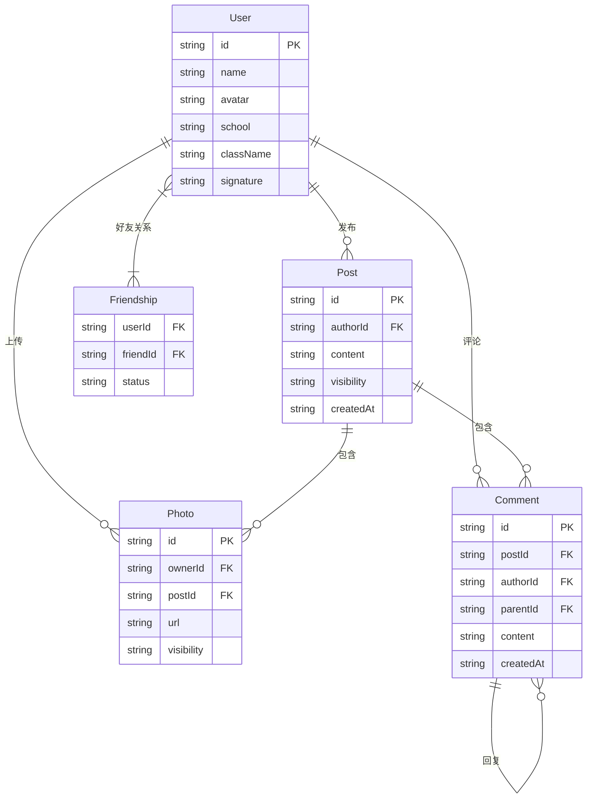

## 1. 架构设计

```mermaid
flowchart TD
    "前端 React SPA" --> "Zustand 状态管理"
    "Zustand 状态管理" --> "Mock 数据层"
    "Mock 数据层" --> "用户数据"
    "Mock 数据层" --> "好友关系数据"
    "Mock 数据层" --> "动态数据"
    "Mock 数据层" --> "照片数据"
    "Mock 数据层" --> "评论回复数据"
```

纯前端架构，所有数据存储在 Zustand 状态管理中，使用 React Router 实现页面路由。

## 2. 技术说明

- **前端**：React@18 + TypeScript + Tailwind CSS + Vite
- **初始化工具**：vite-init (react-ts 模板)
- **状态管理**：Zustand
- **路由**：react-router-dom
- **后端**：无（纯前端 Mock）
- **数据**：前端 Zustand 状态 + Mock 初始数据

## 3. 路由定义

| 路由 | 用途 |
|------|------|
| / | 首页/动态流，显示当前账号的动态和好友动态 |
| /profile/:userId | 个人主页，展示指定用户的信息、动态、照片、好友 |
| /search | 搜索同学页，搜索和加好友 |

## 4. API 定义

无后端 API，所有操作通过 Zustand store 的 action 完成。

## 5. 数据模型

### 5.1 数据模型定义



### 5.2 数据定义

**User**: `id`, `name`, `avatar`(头像色块占位), `school`, `className`, `signature`

**Post**: `id`, `authorId`, `content`, `visibility`("public" | "friends" | "self"), `createdAt`

**Photo**: `id`, `ownerId`, `postId`(可选), `url`(占位色块), `visibility`("public" | "friends" | "self")

**Comment**: `id`, `postId`, `authorId`, `parentId`(回复时指向父评论), `content`, `createdAt`

**Friendship**: `userId`, `friendId`, `status`("accepted" | "pending")

**可见性过滤规则**：
- `public`：所有人可见
- `friends`：仅好友可见
- `self`：仅自己可见
